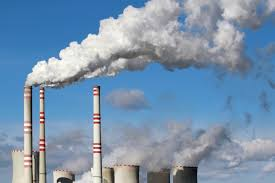
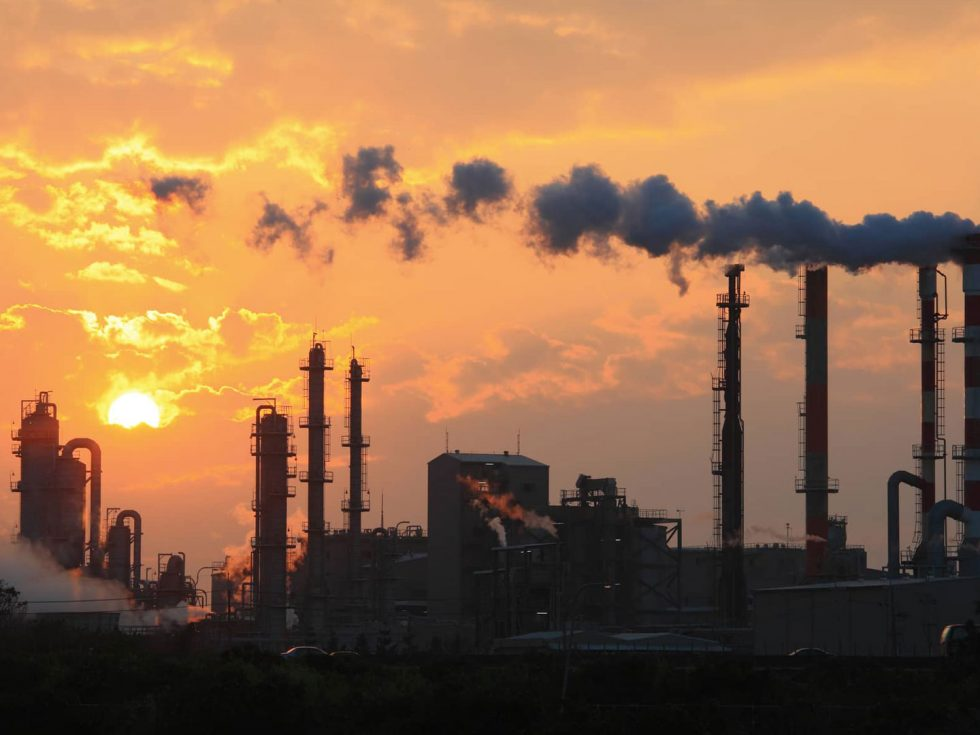
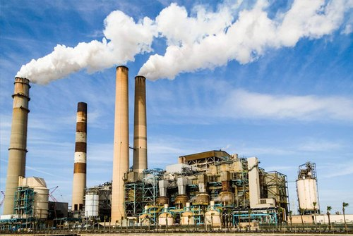
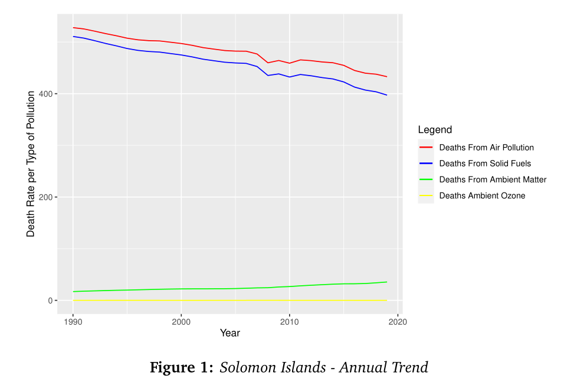
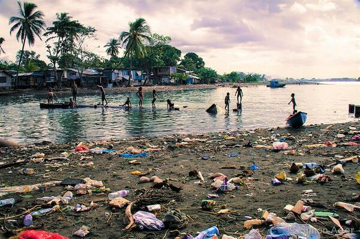
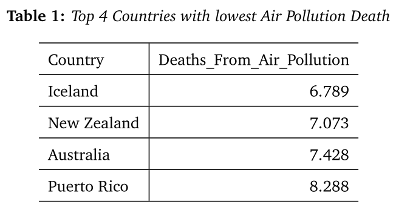
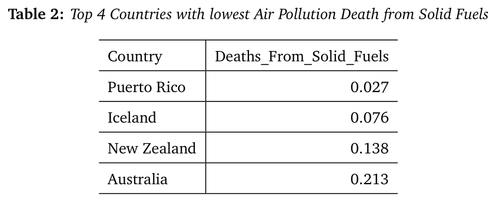

```{r setup, include=FALSE}
options(htmltools.dir.version = FALSE)
```

```{r , echo = FALSE, message = FALSE, warning = FALSE}
library(tidyverse)
library(palmerpenguins)
library(datasets)
library(kableExtra)
```


class: center, middle
```{r out.width='100%', echo=FALSE,fig.align='center'}

```
---
class: left, middle

# Contents

## Report Introduction

## Section 1 - Trends Exploration

## Section 2 - Category Comparison

## Section 3 - Highest and Lowest Air Pollution 

## Conclusion


---
class: left, middle

# Introduction

.blue[ In this research project, we aim to explore and analyze numbers and trends of human's death caused by various air pollution.]


```{r out.width='70%', echo=FALSE,fig.align='center'}

```


.tiny[<span>Photo by <a href="https://online.regiscollege.edu/blog/outdoor-air-pollution/"> Regis College</a>]

---
class: left, top
## Section 1 - Trends Exploration

.blue[.bold[Research Questions]] 

.content-box-soft[ 
- Q1:Top four countries with the highest average number of deaths due to air pollution since 1990 to 2019.]

.content-box-soft[ 
- Q2:Is air pollution in these four countries improving until 2019? ]

.content-box-soft[ 
- Q3:What are the trends in the number of deaths caused by these two pollutants?]


---

### Q1: Top four countries with the highest average number of deaths due to air pollution since 1990 to 2019.


```{r out.width='70%', echo=FALSE,fig.align='center'}
knitr::include_graphics("figs/Screenshot_1.png")
```


The four countries with the highest average number of deaths (per 100,000) due to air pollution are Solomon Islands, Afghanistan, Central African Republic and Somalia.
---

### Q2: Is air pollution in these four countries improving until 2019?

```{r out.width='60%', echo=FALSE,fig.align='center'}
knitr::include_graphics("figs/Screenshot_2.png")
```


---
class: left, middle

# Q3

.green[.bold[How about the outdoor air pollution for these countries?]] 

- Ozone, an atmospheric gas, is often called smog when at ground level. It is created when pollutants emitted by cars, power plants, industrial boilers, refineries, and other sources chemically react in the presence of sunlight.

- Particulate matter is created by vehicle and industrial emissions from fossil fuel combustion. Cigarette smoke, and burning organic matter, such as wildfires, all contain PM.

---
class: left, top

### Q3: What are the trends in the number of deaths caused by these two pollutants?

```{r out.width='60%', echo=FALSE,fig.align='center'}
knitr::include_graphics("figs/Screenshot_3.png")
```

---
class: left, middle
# Section summary

.blue[.bold[Solomon Islands, Afghanistan, Central African Republic and Somalia have seen major improvements in total air pollution, especially indoor air pollution. However, there has been a small increase in the number of deaths caused by particulate matter pollution.]]

---
class: left, top
# Section 2 - Categorical comparison between Vietnam and New Zealand
## Research question

```{r echo = FALSE, warning=FALSE, message=FALSE}
death <- read_csv(here::here("Data/death-rates-from-air-pollution.csv"))
```

```{r echo = FALSE, warning=FALSE, message=FALSE}
death_rate <- death %>%
  filter(Entity %in% c("Vietnam", "New Zealand")) %>%
  rename(Household_air_pollution = "Deaths - Cause: All causes - Risk: Household air pollution from solid fuels - Sex: Both - Age: Age-standardized (Rate)",
         Ambient_particulate_matter_pollution = "Deaths - Cause: All causes - Risk: Ambient particulate matter pollution - Sex: Both - Age: Age-standardized (Rate)",
         Air_pollution = "Deaths - Cause: All causes - Risk: Air pollution - Sex: Both - Age: Age-standardized (Rate)",
         Ambient_ozone_pollution = "Deaths - Cause: All causes - Risk: Ambient ozone pollution - Sex: Both - Age: Age-standardized (Rate)") %>%
  pivot_longer(cols = c("Household_air_pollution",
               "Ambient_particulate_matter_pollution",
               "Air_pollution", 
               "Ambient_ozone_pollution"),
               names_to = "Risk_factor",
               values_to = "Rate")
```

.content-box-soft[ 
- Q1: Which type of pollution is the most common attribute of death over years in each of the countries?
]

.content-box-soft[ 
- Q2: How did the death rates corresponding to different types of pollution change over the years and how different the trends are in both countries?
]


---
class: left, top

## Exploratory analysis

### .bold[Research question 1]

.red[Which type of pollution is the most common attribute of death over years in each of the countries?]

```{r out.width = '70%', echo = FALSE, fig.align="center"}

```

---
class: left, top

### .bold[New Zealand]

```{r echo = FALSE, message=FALSE, warning=FALSE}
death_cause <- death_rate %>%
  group_by(Entity, Risk_factor) %>%
  summarise(mean_rate = mean(Rate))
  
death_cause$mean_rate <- round(death_cause$mean_rate, digits = 2)
  
```

```{r echo = FALSE, message=FALSE, warning=FALSE}
jp <- death_cause %>%
  filter(Entity == "New Zealand")

kable(jp, caption = "Death rate related to different risk factors in New Zealand", col.names = gsub("[_]", " ", names(jp)))
```

.pull-top[
Air pollution contributed most to the death rates in New Zealand with 7.11%]


---
class: left, top

### .bold[Vietnam]


```{r echo = FALSE, message=FALSE, warning=FALSE}
vn <- death_cause %>%
  filter(Entity == "Vietnam")

kable(vn, caption = "Death rate related to different risk factors in Vietnam", col.names = gsub("[_]", " ", names(vn)))
```

.pull-middle[
Air pollution is the largest cause of pollution in Vietnam, which accounts for 131.61%]


---

class: left, middle

.content-box-duke-green[ 

- Air pollution is one of the leading risk factors for deaths across the world.
  
- In 2017, air pollution contributed for approximately 12 percent of global deaths.
  
- The burden of air pollution tends to be greater among low and middle income countries.
]

.pull-right1[


]


---
class: centre, middle

### .bold[Research question 2]

.red[How did the death rates corresponding to different types of pollution change over the years and how different the trends are in each country?]

.left[
```{r out.width = '40%', echo = FALSE, fig.align="left"}

```
]

.right[
```{r out.width = '40%', echo = FALSE, fig.align="right"}

```
]
---

class: center, middle

### .bold[New Zealand]

```{r echo = FALSE, message=FALSE, warning=FALSE}

jp_rate <- death_rate %>%
  filter(Entity == "New Zealand")

p1 <- ggplot(jp_rate, aes(x = Year, y = Rate, color = Risk_factor)) +
  geom_line() +
  scale_x_continuous(breaks = seq(1990, 2019, by=2)) +
  labs(y = "Death rate") +
  theme(axis.text.x = element_text(angle=45, hjust = 1)) +
  ggtitle("Death rate trend in New Zealand from 1990 to 2019")
p1
```


---
class: center, middle

### .bold[Vietnam]


```{r echo = FALSE, message=FALSE, warning=FALSE}
vn_rate <- death_rate %>%
  filter(Entity == "Vietnam")

p2 <- ggplot(vn_rate, aes(x = Year, y = Rate, color = Risk_factor)) +
  geom_line() +
  scale_x_continuous(breaks = seq(1990, 2019, by=2)) +
  labs(y = "Death rate") +
  theme(axis.text.x = element_text(angle=45, hjust = 1)) +
  ggtitle("Death rate trend in Vietnam from 1990 to 2019")
p2
```

---
class: left, top

```{r out.width = '40%', echo = FALSE, fig.align="left"}

```

.content-box-duke-green[
- Air pollution is at the top of the leading risk factors for deaths in both countries. However, in recent decades the death rates from total air pollution has declined.

- Death rates associated with pollution in Vietnam is higher than in New Zealand for all types of pollution.
]

---

class: left, top
# Section 3 - Highest and Lowest Air Pollution
## Research Questions

.content-box-soft[ 
* Q1: Which country has the highest number of Air Pollution caused casualties? 
* And what is its trend across the year pertaining to their cause of deaths severity?
]

.content-box-soft[ 
* Q2: What is the 4 lowest polluted countries? 
* Regarding the comparison between them, what are possible reasons for these significantly low result?
]

---
class: left, top

## Analysis
## Research Question 1 - Graphic

.content-box-soft[ 
* Solomon Islands appears to be the most pollution-led casualties, given their significant amount of deaths over any other countries. 
]

```{r out.width = '50%', echo = FALSE, fig.align="center"}

```

.content-box-soft[ 
* With further exploration, Death from general Air Pollution is the most severe, similarly with Solid Fuels-led pollution. 
]

---
class: left, top

## Research Question 1 - Research and Analysis

.content-box-soft[ 
* With heavily and ever-changing climate change risk, over-deforestation problem and enormous plastic waste issues, Solomon Islands is even more prone to bigger issues 
]


```{r out.width = '70%', echo = FALSE, fig.align="center"}

```

---
class: left, top

## Research Question 2 - Graphic

.content-box-soft[ 
* What are lowest 4 polluted-led cause of death countries?
]

```{r out.width = '70%', echo = FALSE, fig.align="center"}

```

.content-box-soft[ 
* What we can learn from them? 
]

---
class: left, top

## Research Question 2 - Research and Analysis


```{r out.width = '70%', echo = FALSE, fig.align="center"}

```

.content-box-soft[ 
* Based on each country reliance on type of energy consumption, their ability to suppress various air pollution rates.
]

---
class: centre, middle

# Conclusion...

```{r out.width = '90%', echo = FALSE, fig.align="center"}

```

---
class: center, middle


```{r out.width = '100%', echo = FALSE, fig.align="center"}

```


